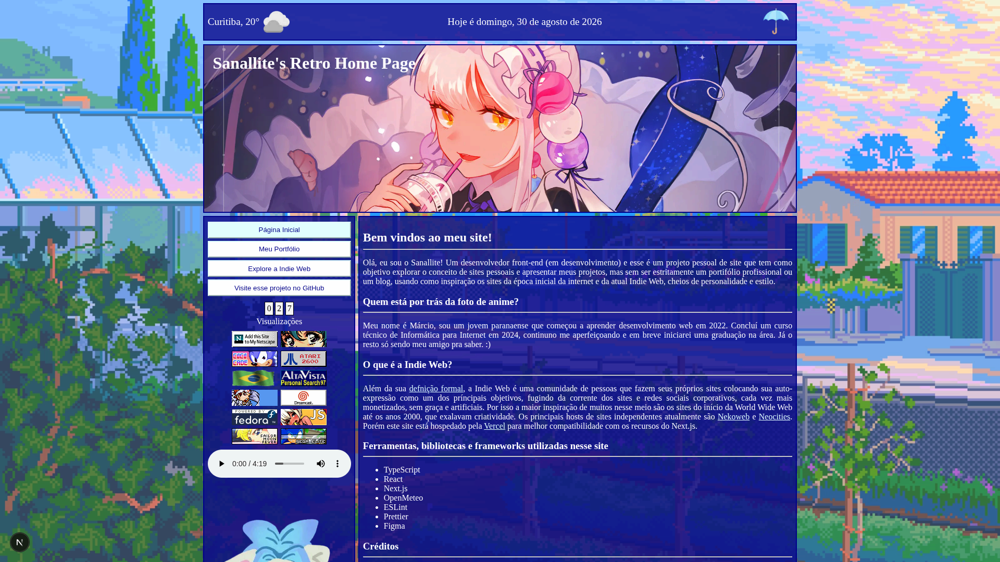
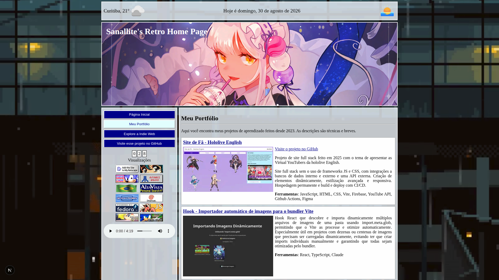

# Retro Home Page

Um site que explora o conceito de blog pessoal misturado com portfólio. Cheio de estilo e o charme da internet antiga e da atual Indie Web!

## [Acesse o Site](https://sanallite-retrohomepage.vercel.app)

## Objetivo

Criar um site com estilo retrô mas utilizando ferramentas e técnicas atuais, com foco em aprofundar meu conhecimento em cada etapa do desenvolvimento web, desde o brainstorming até o deploy com todos os detalhes. Também no uso de [React](https://react.dev) com [Next.js](https://nextjs.org), da [Vercel](https://vercel.com/home) para hospedagem e GitHub Projects para planejar meu fluxo de trabalho.
A ideia de criar um site seguindo os padrões de design da web antiga é uma que eu já tinha há alguns anos e descobrir que existe uma comunidade dedicada a isso me motivou mais.

> [!Important]
> Consulte a [aba de projetos](https://github.com/sanallite/retro_home_page/projects?query=is%3Aopen) para ver o progresso ao longo do tempo.

## Destaques e Funcionalidades
* Integração com a biblioteca/API [OpenMeteo](https://open-meteo.com), para exibição da temperatura atual e mudança do tema do site.
* Dois temas que mudam baseados no clima atual: Sol e Chuva, e ícones que mudam conforme se é dia ou noite.
* Contador de visualizações usando [Upstash Redis](https://upstash.com/redis) através de rota de API, que salva IPs criptografados por 24 horas para contar visualizações únicas.
* Player de áudio com controles nativos e vídeos de fundo.
* Carregamento rápido com o Real Experience Score do Vercel Speed Insights chegando até 100.

## Ferramentas e Detalhes Técnicos
* Single Page Application (SPA) com Server Components e Client Components.
* Responsividade de estilo para diversos tamanhos de tela.
* Uso de CSS Modules, Prettier, ESLint, Vercel Speed Insights.
* Ícones de diversos tamanhos e metadados OpenGraph e Twitter.

## O que é a Indie Web?

Além da sua [defnição formal](https://en.wikipedia.org/wiki/IndieWeb), a Indie Web é uma comunidade de pessoas que fazem seus próprios sites colocando sua auto-expressão como um dos principais objetivos, fugindo da corrente dos sites e redes sociais corporativos, cada vez mais monetizados, sem graça e artificiais. Por isso, a maior inspiração de muitos nesse meio são os sites do início da World Wide Web até os anos 2000, que exalavam criatividade. Os principais hosts de sites independentes atualmente são [Nekoweb](https://nekoweb.org) e [Neocities](https://neocities.org). Porém este site está hospedado pela Vercel para melhor compatibilidade com os recursos do Next.js.

## Posicionamento sobre Inteligência Artificial

Quem conhece a Indie Web sabe que naquela comunidade há uma forte presença de pessoas opostas ao uso de IA em geral, mas principalmente modelos para geração de conteúdo criativo. Neste site não estão incluídos de forma consciente "assets" gerados por IA e todos os recursos, principalmente imagens, estão creditados na página inicial. No entanto eu usarei modelos de LLM, no caso o [Claude](https://claude.ai), para auxílio no desenvolvimento e solução de problemas. Este não é um projeto "vibe-coded", cada aspecto do projeto foi compreendido e revisado por mim, porém também não se encontra no outro lado do espectro, que é a aversão ao uso de Inteligência Artificial para qualquer fim.

## Capturas de Tela

